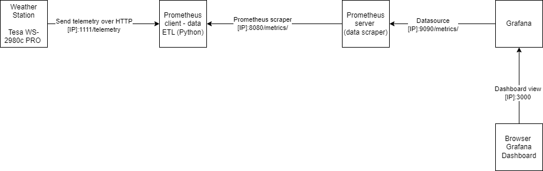
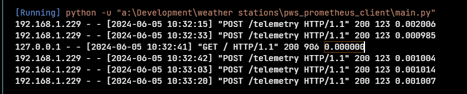

[](https://travis-ci.org/yonush/pws_prometheus_client)

## Introduction

This [Prometheus client](https://github.com/prometheus/client_python) listens for incoming telemetry from single personal weather station usign the EasyWeatherPro and a custom server setup. The firmware at the time of writing was 5.1.6.

The weather station used in this example data is based on the Tesa WS-2980c PRO personal weather station (PWS). 

This uses the EasyWeatherPro firmware found in many other PWS's (Ambient Weather, Ecowitt and other Fine Offset clones)

The current client provides the following features
	
- Port 1111 is open for incoming telemetry from the Weather station - 30-60sec update cycle
- Using port 8080 is for scrape requests from Prometheus - 30sec update loop
- Telemetry saved as JSON in local text file
- Stop this Prometheus Exporter client from the browser
- Metrics being sent to the Prometheus server is based on the Ecowitt format
- Wundergraound data format is planned
- calculates the following:
	- Dewpoint temperature
	- Frostpoint temperature
	- Wind chill index
	- Metservice ["Feels Like"](https://blog.metservice.com/FeelsLikeTemp) temperature

The client assumes a [Prometheus](https://prometheus.io/) server application has been setup to scrape from the above.


The client can be run by simply executing

	python main.py

Successfuly running the client should present you with the similar output


To get the cli options you can use

	python -h

to give 


## TODO
- :white_check_mark: Acquire telemetry from the PWS as Ecowitt format
- :white_check_mark: Send metrics to Prometheus
- :white_check_mark: Include command line arguments
- :white_large_square: Save telemetry in SQLite database
- :white_large_square: Unit tests
- :white_large_square: Receive telemetry in Wundergraound format
- :white_large_square: Grafana dashboard (WIP)

## Simple architecture

The following image below shows the relationship of the PWS client with other components in the weather station system.


The following sesttings were used in the weather station 


When run from the command line or VScode you will get a Flask log output like below


Just browsing to http://localhost:1111 renders the following simple HTML page where you can either click on either

- **metrics** (http://localhost:8080/metrics) to show the metrics to be consumed by Prometheus
- **stop** (http://localhost:1111/stop) to shutdown the pws client. This is especially useful if the client was run as a binary and would require shutting down through a task manager


Examples of the various data dumps can be found in [data_dumps.md](data_dumps.md).

## Dependencies

The PMW client has been tested on Python as early as 3.10.9 and should work jsut fine on later version (3.12.2 was used for testing too)

The Python module requirements tested were the following but other versions should also work

	Flask==3.0.3
	gevent==24.2.1
	prometheus_client==0.20.0

The Flask & Gevent are used to listen and handle the incoming weather station telemetry.

## Prometheus configuration

The following configuration was used for Prometheus

```yml
  # Metrics from the pwsclient.py or binary
  - job_name: "pws_client"
    static_configs:
      - targets: ["localhost:8080"]
        labels:
          group: "Environment"
```

If the ports is changed here for Promentheus then the client code also needs updating.

## Grafana

Currently a work in progress.

## SQLite database 

The client will eventually use SQLite to store the incoming telemetry as a form of longterm storage.


## Building a binary

Although this client runs on any platform, it can be compiled to an .exe for running on Windows in the background.

[Pyinstaller](https://pyinstaller.org/en/stable/) was used to produce the binary. The following commandline was used to produce the binary, assuming Pyinstaller has been installed.

	pyinstaller.exe --onefile --windowed  --icon favicon.ico --name PWSclient --paths .\ main.py 

This should produce a single binary in the dist folder, making the PWS client standalone. There are no other dependencies or configuration files required.


